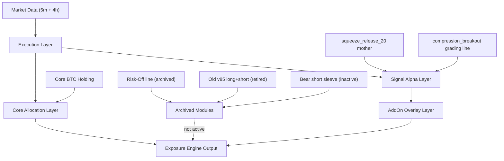

# System Architecture

## Overview

The current repository should be understood as a BTC exposure engine with a locked baseline and clearly separated archived modules.

## Core Allocation Layer

This layer defines the always-on strategic BTC holding.

- current baseline: hold BTC core
- role: provide long-term market participation
- current official structure: core stays active while AddOn logic only modulates incremental exposure

## Signal Alpha Layer

This layer contains the validated BTC long-only mother.

- mother line: `squeeze_release_20`
- research optimal: `lb20_stop3.2_trail5.0_beoff`
- role: identify trend release windows with low-frequency, auditable logic

The alpha layer is not a general signal lab. It is the locked mother system behind current portfolio construction.

## Exposure Control Layer

This layer controls how much additional BTC exposure is added on top of the core.

Current baseline:

- Binary AddOn overlay

Current active extension:

- AddOn grading via `compression_breakout`

Current non-active idea:

- narrow exposure-engine style AddOn modulation

## Archived Modules

These modules remain part of repository history but are not active baseline components.

- Risk-Off line: archived after repeated promotion failure
- old `v85` long+short line: retired as primary research
- Bear short sleeve: inactive

Archived means:

- keep documentation
- keep result files
- do not treat them as active baseline logic
- do not silently resume them

## Execution Layer

All formal strategy claims are tied to the locked execution setup.

Default tuple:

- `next_bar_open`
- `legacy_bar_extrema`
- `midpoint`
- `full_model`

Stress tuple:

- `live_runner_next_5m_close`
- `segment_path_same_bar`
- `pessimistic`
- `full_model`

The execution layer is the guardrail that prevents research drift into idealized backtests.

## Current System Statement

Current official framework:

- Core BTC allocation
- Binary AddOn overlay as the locked baseline
- AddOn grading as the active extension line
- Risk-Off archived

That is the architecture future work should inherit unless the baseline is explicitly revalidated.
