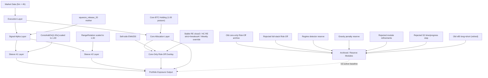

# System Architecture

## Overview

The current repository should be understood as a BTC exposure engine with a locked adopted baseline, a live operating layer, and clearly separated archive / reserve branches.

## Core Allocation Layer

This layer defines the strategic BTC holding.

- role: provide long-term BTC participation
- adopted posture weight: `1.00`
- state machine:
  - `full`
  - `soft_off`
  - `flat`
- the `flat` / `re-entry` transitions are controlled by the active core-only Risk-Off overlay

## Signal Alpha Layer

This layer contains the validated BTC long-only mother.

- mother line: `squeeze_release_20`
- research optimal: `lb20_stop3.2_trail5.0_beoff`
- role: identify trend release windows with low-frequency, auditable logic

The alpha layer is not a general signal lab. It is the locked mother system behind current portfolio construction.

## Sleeve Layers

These layers control additional BTC exposure on top of the core.

### Sleeve #1

- official sleeve: `ConstAddOn[1.00x]`
- adopted posture weight: `1.00`
- role: breakout / expansion participation

### Sleeve #2

- official sleeve: `RangeRotation`
- adopted posture weight: `1.00`
- role: drawdown / sideways-volatility / chop diversification
- not a recovery helper
- not a breakout clone

## Risk-Off Overlay Layer

Current adopted overlay:

- architecture: `core-only`
- sell-side: `EMA250`
- stable normal re-entry: `close3`
- high-churn normal re-entry: `strict EMA50 + breakout_4`
- override re-entry: `Weekly RSI(14) <= 30 hold`

Important boundaries:

- active overlay is not the old archived Risk-Off promotion line
- rejected architecture:
  - full-stack cash-like Risk-Off
- archived line:
  - old core-only Risk-Off / re-entry deep-dive family

## Exposure And Cap Layer

Portfolio exposure is built from:

- Core
- Sleeve #1
- Sleeve #2
- core-only Risk-Off state on the core leg

Governance-approved cap:

- hard total exposure cap: `3.0x`
- `2.5x` remains fallback only if governance later tightens

Legacy reference:

- Binary AddOn overlay

Current closed single-sleeve ideas:

- AddOn grading / repair via `compression_breakout`
- narrow Exposure Engine style dynamic AddOn modulation

Current archived / rejected sleeve ideas:

- `washout_reversal_reclaim`
- `pullback_reclaim_continuation`
- `Sleeve #3` reset candidates

## Archived / Reserve Modules

These modules remain part of repository history but are not active baseline components.

- old core-only Risk-Off line: archived after repeated promotion failure
- full-stack cash-like Risk-Off: rejected
- `compression_breakout -> exhaustion / compound repair`: archived after failing promotion bar
- old `v85` long+short line: retired as primary research
- Bear short sleeve: inactive
- isolated reserve research:
  - `regime_detector_research`
  - `gravity_penalty_research`
- isolated rejected refinement research:
  - `module_refinement_research`
  - corrected `s2_time_stop_research`

Archived means:

- keep documentation
- keep result files
- do not treat them as active baseline logic
- do not silently resume them

## Execution Layer

All formal strategy claims are tied to the locked execution setup.

Default tuple:

- `next_bar_open`
- `legacy_bar_extrema`
- `midpoint`
- `full_model`

Stress tuple:

- `live_runner_next_5m_close`
- `segment_path_same_bar`
- `pessimistic`
- `full_model`

The execution layer is the guardrail that prevents research drift into idealized backtests.

## Operating Layer

The current mainline is no longer just a research stack. It has an operating layer:

- `live_operating_layer/`
  - state panel
  - decision memo
  - onboarding playbook
  - live status runner
- `dashboard/`
  - strict data refresh
  - signal recomputation
  - current signal PNG / JSON / MD output
- `historical_signal_atlas/`
  - long-span signal review
  - TradingView overlay support

## Current System Statement

Current official framework:

- Core BTC allocation
- `ConstAddOn[1.00x]` as `Sleeve #1`
- `RangeRotation` as official `Sleeve #2`
- core-only Risk-Off overlay
- adopted running posture:
  - `Core 1.00 / Sleeve1 1.00 / Sleeve2 1.00`
- hard total exposure cap `3.0x`
- Binary AddOn as legacy reference only
- second sleeve discovery completed
- old Risk-Off archived, new adopted core-only overlay active
- single-sleeve timing closed
- launch state `LAUNCH_GO`

That is the architecture future work should inherit unless the baseline is explicitly revalidated.
