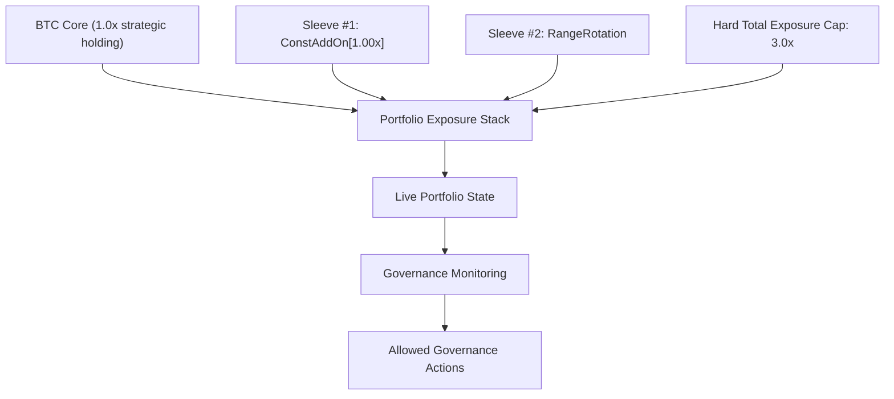

# Multi-Sleeve Architecture

## Purpose

This document defines the clean operating architecture of the approved formal BTC portfolio:

- `Core BTC holding`
- `Sleeve #1 = ConstAddOn[1.00x]`
- `Sleeve #2 = RangeRotation`
- approved hard total exposure cap = `3.0x`

This is an operating design document, not a new signal or optimization document.

## Architecture Summary

The architecture is additive and hierarchical:

1. `Core` is always on.
2. `Sleeve #1` is the main gain sleeve.
3. `Sleeve #2` is the drawdown / chop diversification sleeve.
4. The cap is a portfolio-level hard limit, not a new signal.

## Portfolio State Model

### State 1: `Core-Only`

- Exposure: `1.0x`
- Sleeve state: both sleeves inactive
- Interpretation: strategic BTC carry without incremental alpha sleeves
- Governance meaning: normal and expected, not a failure state

### State 2: `Expansion-Carry`

- Exposure: `1.0x + Sleeve #1`
- Sleeve state: only `ConstAddOn[1.00x]` active
- Interpretation: primary trend / expansion participation
- Governance meaning: main gain state, normally higher upside sensitivity

### State 3: `Diversification-Carry`

- Exposure: `1.0x + Sleeve #2`
- Sleeve state: only `RangeRotation` active
- Interpretation: chop / sideways / drawdown-diversification participation
- Governance meaning: defensive diversification state, not a recovery override

### State 4: `Stacked Multi-Sleeve`

- Exposure: `1.0x + Sleeve #1 + Sleeve #2`
- Sleeve state: both sleeves active
- Interpretation: approved dual-sleeve participation
- Governance meaning: this is intentional stacking, not accidental leverage

### State 5: `Cap-Constrained Stacked`

- Exposure: desired gross would exceed the operational soft zone and approaches the hard cap
- Sleeve state: both sleeves active and total exposure is high
- Interpretation: same portfolio logic as `Stacked Multi-Sleeve`, but now under explicit cap monitoring
- Governance meaning: requires closer attention to cap headroom and path burden

### State 6: `Governance Attention`

- Exposure: any of the above
- Sleeve state: any of the above
- Trigger: path-burden or cap-alert thresholds breached
- Interpretation: not a new trading state; it is an operational oversight state

## Exposure Budgeting Hierarchy

### Layer budgets

- `Core`: strategic base layer, budgeted at `1.0x`
- `Sleeve #1`: tactical expansion layer, budgeted up to `1.0x`
- `Sleeve #2`: tactical diversification layer, budgeted up to `1.0x`
- `Total`: hard portfolio cap at `3.0x`

### Interpretation

- The portfolio should be read as `1.0x core + optional sleeve increments`.
- A sleeve being active means it is consuming part of the approved incremental exposure budget.
- When both sleeves are active, the correct interpretation is approved stacked deployment, not informal leverage.

### Budget logic

- `Core` has seniority: it is never displaced by sleeve logic.
- `Sleeve #1` and `Sleeve #2` are peer tactical layers under the same portfolio cap.
- The cap is enforced at portfolio level after summing `Core + Sleeve #1 + Sleeve #2`.

## Activation And Conflict Handling

This framework does not introduce conflict-resolution trading logic. It introduces categorization and reporting clarity.

### Only Sleeve #1 active

- Label: `Expansion-Carry`
- Message: trend alpha is active, diversification sleeve is inactive

### Only Sleeve #2 active

- Label: `Diversification-Carry`
- Message: chop / drawdown diversification is active, main gain sleeve is inactive

### Both sleeves active

- Label: `Stacked Multi-Sleeve`
- Message: both approved alpha ecologies are active together
- Monitoring priority: cap headroom, overlap persistence, and path burden

### Neither sleeve active

- Label: `Core-Only`
- Message: only the strategic BTC layer is engaged

### If desired gross presses toward cap

- Label: `Cap-Constrained Stacked`
- Message: approved stack is active, but governance attention is now focused on cap utilization and live burden

## Design Boundary

This architecture document does not authorize:

- new signals
- sleeve reweighting research
- timing overlays
- reopening frozen research lines

It only specifies how the approved portfolio should be understood and operated.
